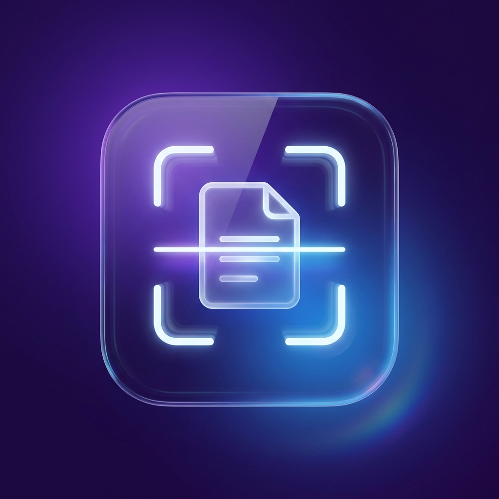

# ScreenOCR

ScreenOCR is a powerful, lightweight macOS Menu Bar utility that allows you to instantly capture and recognize text, QR codes, and barcodes from anywhere on your screen using Apple's native Vision framework.



## Features

-   **Smart Text Recognition**: Instantly extracts text from any captured area.
-   **QR & Barcode Scanning**: Automatically detects QR codes and barcodes, copying their payload (links, text) to your clipboard.
-   **Multi-Language Support**: Automatically detects and recognizes text in all languages supported by your macOS version (English, Chinese, French, German, Spanish, etc.).
-   **Visual Feedback (HUD)**: A sleek, darker-blurred "Copied!" notification appears at the bottom of your screen to confirm successful captures.
    -   *Toggleable via Preferences.*
-   **Clipboard Integration**: Recognized text is automatically copied to your clipboard, ready to paste.
-   **Global Shortcut**: Customizable global hotkey to start capturing immediately.
    -   *Default:* `Cmd + Shift + C`
-   **Native & Private**: Uses valid on-device macOS APIs (Vision Framework). No data leaves your computer.

## Installation

### Using the Installer
1.  Locate the `ScreenOCR_Installer.dmg` file in the project directory.
2.  Double-click to open it.
3.  Drag the **ScreenOCR** app icon into the **Applications** folder shortcut.
4.  Launch **ScreenOCR** from your Applications folder.

### Building from Source
Prerequisites: macOS with Swift installed.
```bash
./bundle_app.sh
```
This script compiles the app, generates the icon, and packages it into `ScreenOCR.app`.

## How to Use

1.  **Launch the App**: You will see a **Document Icon** (`doc.text.fill`) in your menu bar.
2.  **Start Capture**:
    -   Click the Menu Bar icon and select **Scan Selection**.
    -   OR use the global shortcut: **Command + Shift + C**.
3.  **Select Area**:
    -   The screen will dim.
    -   Click and drag to draw a box around the text or QR code you want to capture.
    -   Release to capture.
4.  **Success**:
    -   You will see a "Text Copied" or "QR Code Copied" HUD at the bottom of the screen.
    -   The content is now in your clipboard! Paste it anywhere (`Cmd + V`).

### Preferences
Click the Menu Bar icon -> **Preferences...** to:
-   Change the global keyboard shortcut.
-   Toggle the Visual HUD on or off.

## Troubleshooting

-   **Permissions**: The app requires **Screen Recording** permission to "see" the text on your screen.
    -   If prompted, click "Open System Settings" and enable ScreenOCR.
    -   *Note:* Since this is a developer build, you may need to re-grant permission if you rebuild the app.
-   **App Won't Open**: If macOS prevents the app from opening due to security verification:
    ```bash
    xattr -cr /Applications/ScreenOCR.app
    ```

## License
MIT
